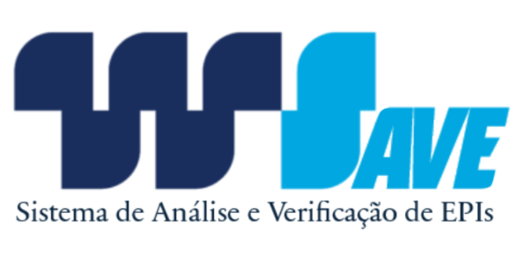

# WSave - Sistema de Análise e Verificação de EPIs em Tempo Real
<p align="center">
  
</p>

## 1. Resumo do Projeto

O **WSave** é uma solução de visão computacional desenvolvida para o Hackathon 2025 da Wilson Sons. O projeto atende ao **Desafio 2: Visão Computacional para EPIs**, propondo um sistema inteligente e automatizado para a fiscalização do uso de Equipamentos de Proteção Individual.

O objetivo é aumentar a segurança e a conformidade nas áreas operacionais através de um checkpoint digital que analisa o vídeo de uma câmera em tempo real para validar se os colaboradores estão utilizando os EPIs corretos antes de acessar uma zona de risco. A solução foi projetada para ser embarcada em um totem físico, atuando como um "Guardião de EPI Digital" proativo, com grande **potencial de impacto e aplicabilidade prática** (item 4.7 do regulamento).

O nome WSave une a identidade da Wilson Sons (WS) ao seu principal propósito: "Save" (salvar), que também é acrônimo para "Sistema de Análise e Verificação de EPIs". A solução foi projetada não apenas para salvar recursos e otimizar processos, mas, acima de tudo, para salvar vidas, garantindo a segurança e a integridade dos nossos colaboradores de forma proativa e inteligente.

### Demonstração Ao Vivo

**[>> Acesse o WSave em Ação! <<](https://erickfjsantos314.github.io/hackathon-wilson-sons-wsave/)**

---

## 2. Funcionalidades do Protótipo

A aplicação atual é um protótipo funcional de alta fidelidade que simula a experiência do totem e inclui:

* **Detecção em Tempo Real:** A análise é feita diretamente no navegador (`client-side`), garantindo respostas instantâneas sem a necessidade de um servidor para a inferência.
* **Interface de Verificação Dinâmica:** Ao detectar uma pessoa, uma interface lateral (checklist) é exibida, listando os EPIs necessários para aquela área.
* **Checklist de Segurança Customizável:** A solução foi projetada com flexibilidade. A lista de EPIs a serem verificados é definida na constante `episToCheck` do código. Isso permite que a mesma solução seja implantada em diferentes áreas com requisitos de segurança distintos (ex: oficina vs. pátio), demonstrando o **potencial de escalabilidade e expansão** do projeto (item 4.5).
* **Feedback Visual e Sonoro:** O checklist marca com `✅`/`❌` os EPIs e altera a cor de fundo para indicar conformidade, e um som de sucesso é emitido quando todos os itens são validados.
* **Toggle de Visualização:** Um botão permite ao operador mostrar ou esconder as caixas de detecção (bounding boxes), alternando entre um modo técnico/depuração e uma interface limpa.

---

## 3. Arquitetura e Tecnologias Utilizadas

A solução foi construída em duas fases principais, seguindo os padrões e tecnologias especificados pelo hackathon.

#### **Fase 1: Treinamento do Modelo de IA**

O processo de criação do modelo foi conduzido na nuvem, comprovado por um documento que se encontra na pasta /docs do repositório. O que constitui a **demonstração do treinamento e adaptação do modelo** (item 4.5 do regulamento).

* **Cloud Provider:** Amazon Web Services (em conformidade com o item 4.3).
* **Serviços AWS:**
    * **AWS S3:** Para armazenamento e versionamento do dataset.
    * **AWS SageMaker:** Para o provisionamento do ambiente e execução do treinamento (em conformidade com o item 4.2 sobre uso de soluções AWS/GCP).
* **Arquitetura do Modelo:** O modelo de IA é um **YOLOv8**, treinado para reconhecer **8 classes distintas**: a classe "Pessoa" e 7 tipos de EPIs.
* **Artefato Final:** O modelo treinado foi otimizado e exportado para o formato **ONNX** para máxima performance e compatibilidade na web.

#### **Fase 2: Aplicação Client-Side (Interface do Totem)**

O protótipo que executa a análise em tempo real foi desenvolvido com as seguintes tecnologias:

* **Framework Principal:** **React.js** (em conformidade com o item 4.1 do regulamento, que especifica o framework corporativo).
* **Motor de Inferência:** ONNX Runtime Web.
* **Linguagem:** JavaScript (ES6+) e CSS3, com foco em uma interface responsiva que se adapta a diferentes formatos de tela (item 4.1).

---

## 4. Como Executar o Projeto Localmente

**Pré-requisitos:**
* Node.js e npm (v16 ou superior)
* Git

**Passos para Instalação:**

1.  **Clone o repositório:**
    ```bash
    git clone [https://github.com/ErickFJSantos314/hackathon-wilson-sons-wsave.git](https://github.com/ErickFJSantos314/hackathon-wilson-sons-wsave.git)
    ```

2.  **Navegue até a pasta do projeto:**
    ```bash
    cd hackathon-wilson-sons-wsave
    ```

3.  **Instale as dependências do projeto:**
    ```bash
    npm install
    ```

4.  **Inicie a aplicação em modo de desenvolvimento:**
    ```bash
    npm start
    ```

5.  Abra seu navegador e acesse `http://localhost:3000`.

---

## 5. Próximos Passos (Roadmap)

Este protótipo serve como uma base sólida para um produto final. O plano de implementação futuro está alinhado com a necessidade de **aplicabilidade prática e viabilidade de integração** com os sistemas da WS (itens 4.7 e 4.9 do regulamento).

* **Hardware:** Embarcar a aplicação em um hardware dedicado (mini-PC + câmera + tela) para criar o totem físico.
* **Otimização:** Migrar a aplicação para uma solução nativa em Python com OpenCV para maximizar a performance no hardware do totem.
* **Integração:** Conectar o sistema a dispositivos físicos, como catracas e sinalizadores luminosos, e a sistemas internos da WS (item 4.5).
* **Back-end e Dados:** Desenvolver uma API para centralizar o gerenciamento dos totens, permitindo a customização remota dos checklists e a coleta de dados para relatórios de conformidade.

## 6. Documentos

Os documentos solicitados no regulamento podem ser encontrados na pasta /docs do repositório.

* **Evidências de treinamento do modelo - WSave**
* **Fluxograma de Operação em Tempo Real - WSave**
* **Plano de escalabilidade e expansão - WSave**
* **Diagrama de modelo de uso - WSave**
* **Arquitetura de treinamento e otimização do modelo - WSave**
* **Documento de Precificação – WSave**
* **Pich - Wsave**

---

### 👨‍💻Equipe

* **Erick Santos** - [GitHub](https://github.com/ErickFJSantos314) [Linkedln](www.linkedin.com/in/erick-francisco-de-jesus-santos-28a756274)
* **Gillian Silva** - [Linkedln](https://www.linkedin.com/in/gillian-silva-contabeis/)
